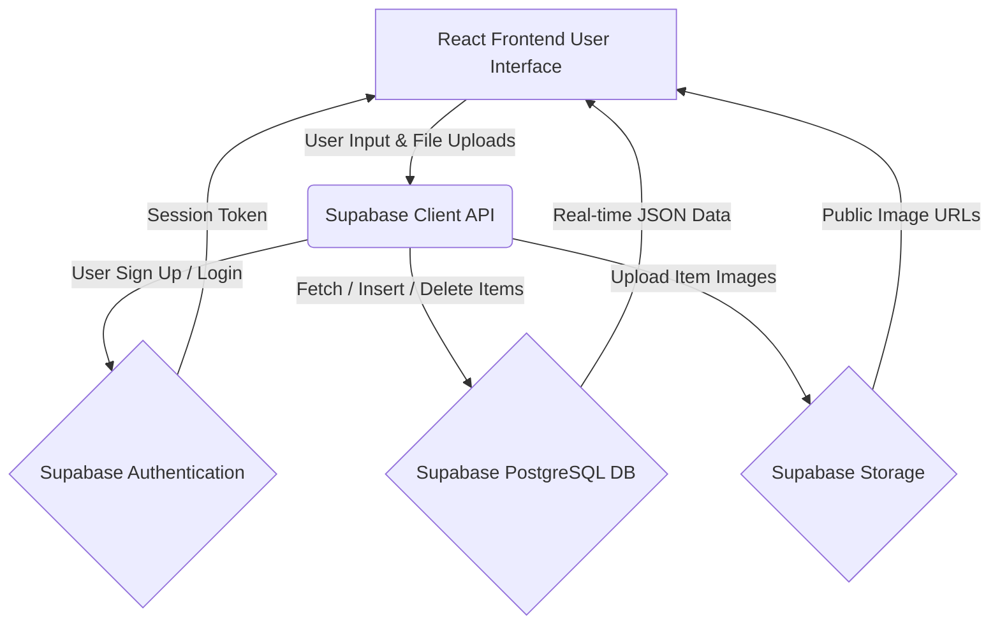

# EquiShare Ruhuna 🎓

## Problem Statement
University of Ruhuna students (especially in the Faculty of Engineering) frequently need expensive, temporary equipment like scientific calculators, lab gear, or DSLR cameras for short-term projects. Buying these outright is a massive financial burden, and there is no secure, centralized platform to borrow or rent these items from peers on campus.

## Solution Overview
EquiShare Ruhuna is a secure, peer-to-peer campus rental platform. It empowers students to list their underutilized equipment for rent or borrowing, creating a sustainable, financially accessible sharing economy exclusively for the university community. 

## Technologies Used 
* **Frontend:** React (Vite) & Tailwind CSS 
  * *Evidence:* UI and styling implemented across all files in the `src/components/` folder.
* **Backend & Database:** Supabase (PostgreSQL)
  * *Evidence:* Database connection and queries handled in `src/supabaseClient.js` and `src/App.jsx`.
* **Authentication:** Supabase Auth
  * *Evidence:* Registration and login logic implemented in `src/components/AuthModal.jsx`.
* **Image Storage:** Supabase Storage Buckets
  * *Evidence:* Image upload logic to the `item-images` bucket found in the `handleSaveListing` function in `src/App.jsx`.
* **Hosting:** Vercel 
  * *Evidence:* See the live deployment URL below.

## Architectural Diagram
Below is the data flow and architecture of EquiShare Ruhuna:

## Key Features
* 🔒 **Exclusive Campus Access:** Only verified @engug.ruh.ac.lk emails can register.
* 📸 **Fullscreen Lightbox:** High-quality image viewing for equipment inspection.
* 🛡️ **Secure Contact:** Phone numbers and WhatsApp links are hidden behind a login wall.
* ✏️ **Owner Controls:** Users can update their profile, list new items, and update/delete their own listings securely.
* 📊 **Live Dashboard:** Real-time metrics on registered users and active listings.

## Deployment URL
https://equishare-ruhuna.vercel.app
